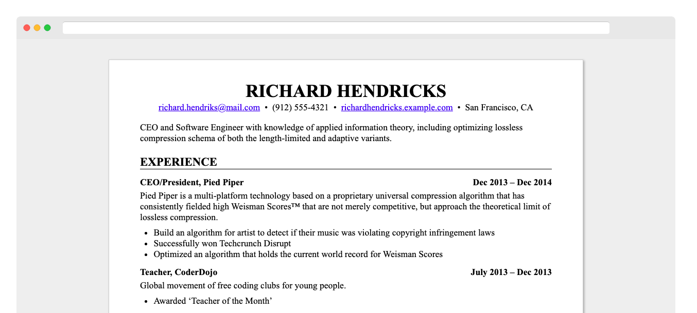

# resume.md

Write your resume in
[Markdown](https://raw.githubusercontent.com/mikepqr/resume.md/main/resume.md),
style it with [CSS](resume.css), output to [HTML](resume.html) and
[PDF](resume.pdf).

## Instructions

 1. Get a copy of this repository by [using the
    template](https://github.com/mikepqr/resume.md/generate), forking, or
    cloning

 2. Install the dependencies:
    <pre>
    pip install <a href="https://python-markdown.github.io/">markdown</a> <a href="https://weasyprint.org/">weasyprint</a>
    </pre>
    Note weasyprint has additional non-python dependencies (cairo, Pango and
    GDK-PixBuf). See the [weasyprint documentation for
    details](https://weasyprint.readthedocs.io/en/latest/install.html).

 3. Edit [resume.md](resume.md) (the placeholder text is taken with thanks from the 
    [JSON Resume Project](https://jsonresume.org/themes/))

 4. Run `make resume` to build resume.html and resume.pdf. If `make` is not
    available (e.g. Windows) run `python resume.py` then `weasyprint resume.html
    resume.pdf` instead.

Optionally, run `make watch` while you are working on your resume to rebuild it
whenever resume.md or resume.css change (requires
[entr](http://eradman.com/entrproject/)).

## Customization

Edit [resume.css](resume.css) to change the appearance of your resume. The
default style is extremely generic, which is perhaps what you want in a resume,
but CSS gives you a lot of flexibility. See, e.g. [The Tech Resume
Inside-Out](https://www.thetechinterview.com/) for good advice about what a
resume should look like (and what it should say).

Change the appearance of the PDF version (without affecting the HTML version) by
adding rules under the `@media print` CSS selector.

Change the margins and paper size of the PDF version by editing the [`@page` CSS
rule](https://developer.mozilla.org/en-US/docs/Web/CSS/%40page/size).

[python-markdown](https://python-markdown.github.io/) is by default a very basic
markdown compiler, but it has a number of optional extensions that you may want
to enable (by adding to [the list of extensions
here](https://github.com/mikepqr/resume.md/blob/5d99e02bf65ff6a2a0ccd18c1a0255c26ec59377/resume.py#L41)).
<code><a
href="https://python-markdown.github.io/extensions/attr_list/">attr_list</a></code>
in particular may by useful if you are editing the CSS.

## Tips

The simplest way to maintain multiple versions of your resume is to comment bits
of text in or out based on the audience. This can be done with standard HTML
comment syntax (e.g. `<!-- Skills: Microsoft Word -->`) but beware that
commented out text will be included in the HTML source that you are presumably
going to put online or share.

An alternative is to keep snippets of Markdown (or CSS) in separate files, and
collect them into a single file for each version of your resume using a
templating tool, makefile or shell script.

Use, e.g. `git tag` to record which version of the resume you sent to which
person.

Use `git diff --word-diff` to make `git diff` more legible (this applies any
time you run git diff on natural language).

